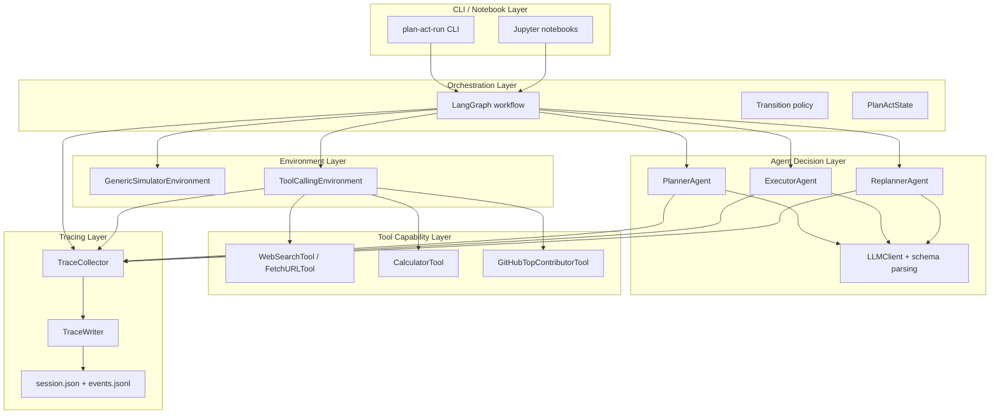
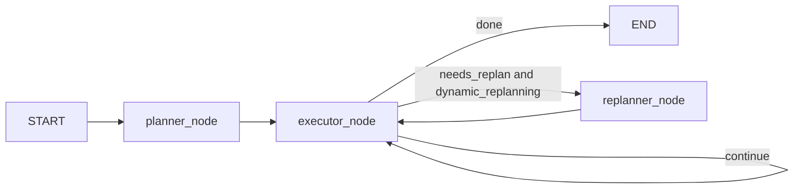
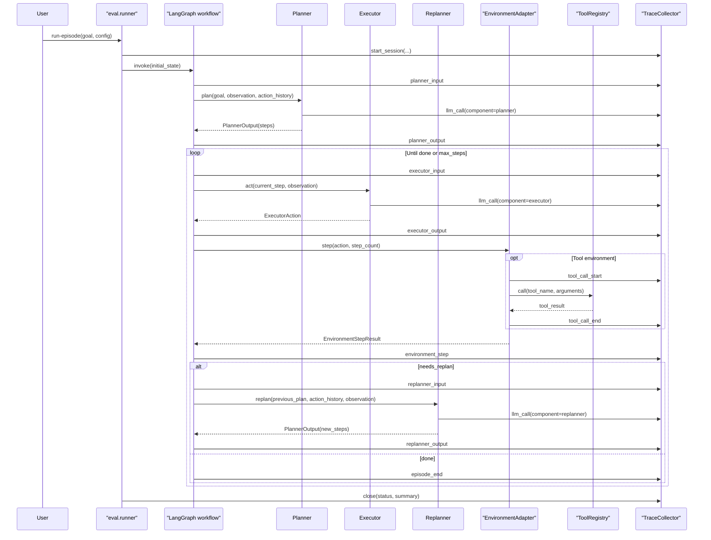
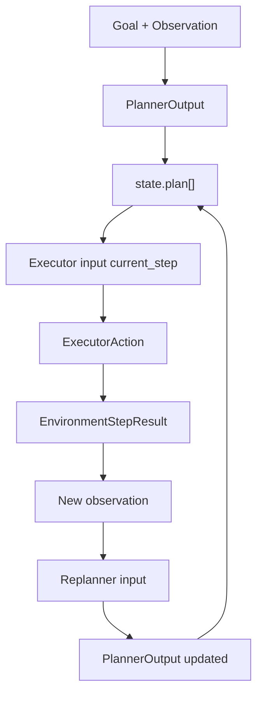
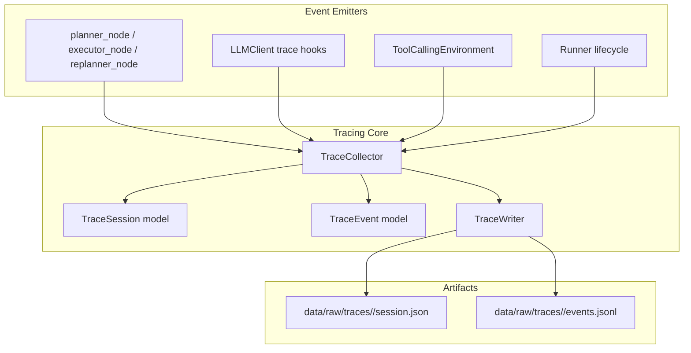

# Agent Architecture Visual Guide

This document explains the **current** architecture of this repository with diagrams that render in GitHub and most IDE Markdown previews.

Navigation:
- Overview guide: [`AGENT_FRAMEWORK_ARCHITECTURE.md`](AGENT_FRAMEWORK_ARCHITECTURE.md)
- Planning/orchestration deep dive: [`PLANNING_ORCHESTRATION_DEEP_DIVE.md`](PLANNING_ORCHESTRATION_DEEP_DIVE.md)
- Trace plan for training data: [`TRAINING_DATA_TRACING_PLAN.md`](TRAINING_DATA_TRACING_PLAN.md)

## 1) One-page architecture summary

The system is a Plan-and-Act agent with explicit modules:
1. `Planner` produces multi-step plans.
2. `Executor` converts one step into one action.
3. `Environment` executes actions (simulator/tool domain).
4. `Replanner` updates plan from latest observations.
5. `LangGraph` orchestrates transitions.
6. `TraceCollector` records session + event timeline for analysis and training-data pipelines.

Core code:
- Workflow graph: [`src/plan_and_act/graph/workflow.py`](src/plan_and_act/graph/workflow.py)
- Runner entrypoint: [`src/plan_and_act/eval/runner.py`](src/plan_and_act/eval/runner.py)
- Agent modules: [`src/plan_and_act/agents/`](src/plan_and_act/agents/)
- Environment adapters: [`src/plan_and_act/environments/`](src/plan_and_act/environments/)
- Tracing infra: [`src/plan_and_act/tracing/`](src/plan_and_act/tracing/)

## 2) Layered architecture (logical view)

## 3) Runtime control flow (state-machine view)

Where implemented:
- Graph wiring: [`src/plan_and_act/graph/workflow.py`](src/plan_and_act/graph/workflow.py)
- Route policy: [`src/plan_and_act/graph/transitions.py`](src/plan_and_act/graph/transitions.py)

## 4) Sequence diagram (single run)

## 5) Data contracts between modules

Schemas:
- Planner/Action models: [`src/plan_and_act/core/schemas.py`](src/plan_and_act/core/schemas.py)
- Runtime state: [`src/plan_and_act/core/state.py`](src/plan_and_act/core/state.py)
- Type constraints: [`src/plan_and_act/core/types.py`](src/plan_and_act/core/types.py)

## 6) Tracing architecture and storage

Tracing code:
- Collector: [`src/plan_and_act/tracing/collector.py`](src/plan_and_act/tracing/collector.py)
- Schemas: [`src/plan_and_act/tracing/schemas.py`](src/plan_and_act/tracing/schemas.py)
- Writer: [`src/plan_and_act/tracing/writer.py`](src/plan_and_act/tracing/writer.py)

## 7) What architecture style is this?

Current style:
1. **Plan-and-Act orchestration** at graph level.
2. **ReAct-like action generation** at executor level (structured action from observation).
3. **Code-controlled runtime policy** for transitions, stop conditions, and replanning.
4. **Not CodeAct** (no generate-code-then-execute loop).

## 8) Strengths of current architecture

1. Strong modular boundaries: planner/executor/replanner/environment/tools are replaceable.
2. Explicit control flow: transitions are inspectable and testable.
3. Good observability baseline: trace session + event timeline + LLM call traces.
4. Domain-agnostic runtime: browser is only one possible adapter, not mandatory.

## 9) Current bottlenecks and extension points

Bottlenecks:
1. Planner is not fully tool-aware by explicit tool manifest in prompt.
2. Trace-to-SFT conversion is still minimal in current builders.
3. Dataset quality gates are still lightweight compared to production training standards.

Extension points:
1. Add tool-aware planning prompt templates.
2. Add richer role-specific SFT exporters with lineage.
3. Add stricter dataset validators and leakage checks.
4. Add browser adapter without changing graph orchestration core.

## 10) Practical file map

1. Orchestration:
- [`src/plan_and_act/graph/workflow.py`](src/plan_and_act/graph/workflow.py)
- [`src/plan_and_act/graph/transitions.py`](src/plan_and_act/graph/transitions.py)

2. Agents:
- [`src/plan_and_act/agents/planner.py`](src/plan_and_act/agents/planner.py)
- [`src/plan_and_act/agents/executor.py`](src/plan_and_act/agents/executor.py)
- [`src/plan_and_act/agents/replanner.py`](src/plan_and_act/agents/replanner.py)

3. Environment + tools:
- [`src/plan_and_act/environments/tooling.py`](src/plan_and_act/environments/tooling.py)
- [`src/plan_and_act/tools/factory.py`](src/plan_and_act/tools/factory.py)
- [`src/plan_and_act/tools/web.py`](src/plan_and_act/tools/web.py)
- [`src/plan_and_act/tools/calc.py`](src/plan_and_act/tools/calc.py)
- [`src/plan_and_act/tools/github.py`](src/plan_and_act/tools/github.py)

4. Tracing:
- [`src/plan_and_act/tracing/collector.py`](src/plan_and_act/tracing/collector.py)
- [`src/plan_and_act/tracing/schemas.py`](src/plan_and_act/tracing/schemas.py)
- [`src/plan_and_act/tracing/writer.py`](src/plan_and_act/tracing/writer.py)

## 11) Rendering tips (IDE and browser)

1. GitHub renders Mermaid blocks natively.
2. In IDE, use Markdown preview with Mermaid enabled.
3. If Mermaid is disabled in IDE preview, open the file in GitHub for final visual rendering.

