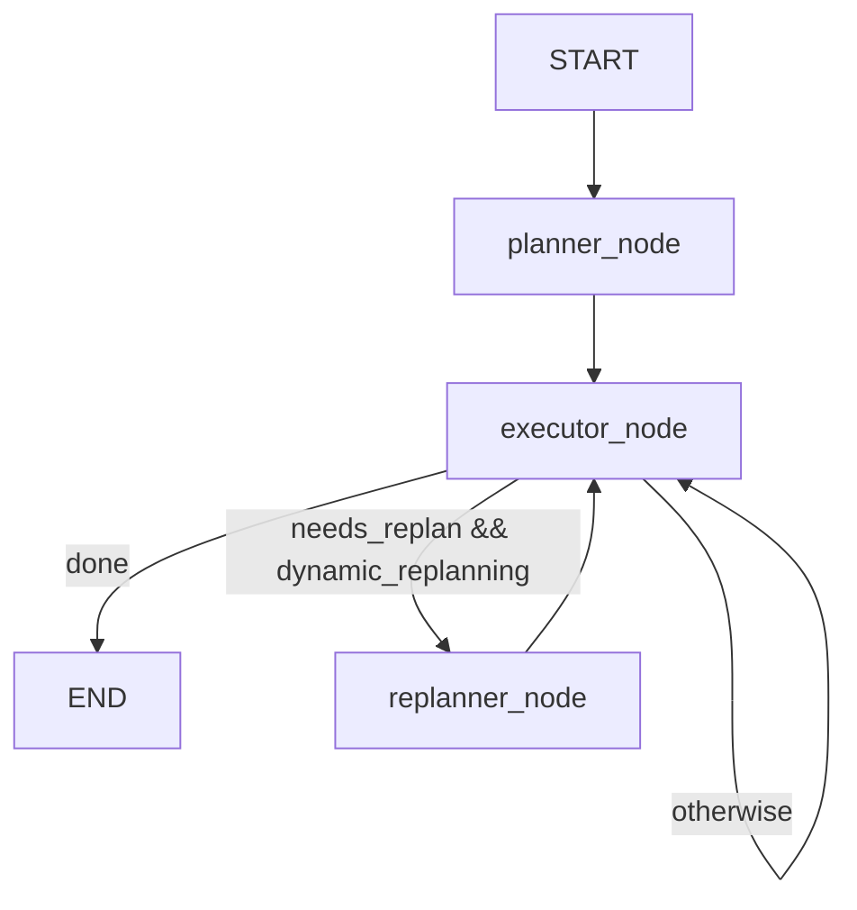

# Planning, Orchestration, and Execution Deep Dive

This document answers the recent design questions in one place, with direct links to source files.

## 1) Direct answers to your questions

1. Is planner output a multi-step plan?
- Yes. Planner returns `PlannerOutput` with `steps: list[PlanStep]`.
- Not reactive-only.

2. Is runtime purely reactive planning?
- No. It is hybrid:
- Planner creates a multi-step plan first.
- Executor runs step-by-step.
- Replanner can replace the remaining plan after each step when enabled.

3. Is orchestration code-controlled?
- Yes. Control flow is implemented in graph node logic and transition rules.
- LLM produces structured decisions (plan/action), but loop control is deterministic code.

4. Is this based on LangGraph or custom from scratch?
- Based on LangGraph (`StateGraph`, `START`, `END`) plus custom node implementations.

## 2) Planning format

Planner prompt config:
- System prompt and user template: [`configs/prompts/planner.yaml`](configs/prompts/planner.yaml)

Planner JSON schema contract:

```json
{
  "goal": "string",
  "steps": [
    {
      "step_id": 1,
      "intent": "string",
      "success_criteria": "string"
    }
  ]
}
```

Where enforced:
- Schema type: [`src/plan_and_act/core/schemas.py`](src/plan_and_act/core/schemas.py)
- Prompt-level instruction for JSON output: [`src/plan_and_act/agents/planner.py`](src/plan_and_act/agents/planner.py)

Replanner uses the same output schema:
- [`configs/prompts/replanner.yaml`](configs/prompts/replanner.yaml)
- [`src/plan_and_act/agents/replanner.py`](src/plan_and_act/agents/replanner.py)

## 3) How plan parsing works

Pipeline:

1. Planner calls `LLMClient.chat_json(...)`.
2. LLM output is parsed by JSON loader.
3. If strict parse fails, fallback tries fenced JSON or substring extraction.
4. Parsed payload is validated by Pydantic into `PlannerOutput`.
5. `planner_node` stores `plan` into workflow state.

Key code:
- LLM JSON call + fallback parse: [`src/plan_and_act/utils/llm.py`](src/plan_and_act/utils/llm.py)
- Planner validation: [`src/plan_and_act/agents/planner.py`](src/plan_and_act/agents/planner.py)
- State update in planner node: [`src/plan_and_act/graph/workflow.py`](src/plan_and_act/graph/workflow.py)

## 4) How worker executes the plan

Executor handoff logic:

1. Read `plan[current_step_idx]` from state.
2. Validate into `PlanStep`.
3. Ask `ExecutorAgent` for one `ExecutorAction`.
4. Run environment step with that action.
5. Update observation, history, and route to continue/replan/end.

Execution code:
- Worker action generation: [`src/plan_and_act/agents/executor.py`](src/plan_and_act/agents/executor.py)
- Node orchestration and routing: [`src/plan_and_act/graph/workflow.py`](src/plan_and_act/graph/workflow.py)
- Transition policy: [`src/plan_and_act/graph/transitions.py`](src/plan_and_act/graph/transitions.py)

## 5) Orchestration model (LangGraph + policy code)



Runtime assembly:
- Build graph and invoke:
- [`src/plan_and_act/eval/runner.py`](src/plan_and_act/eval/runner.py)

## 6) Tool awareness status

Current status:
- Planner prompt does not explicitly include full tool registry metadata.
- So planner is not fully "tool-aware planning" in the strict sense.

What exists now:
- Environment has a real tool registry and can execute no-key tools:
- `web_search`, `fetch_url`, `calculator`, `github_top_contributor`.
- Mapping from action type to tool is resolved in environment logic.

Tooling code:
- Tool registry and default tool set: [`src/plan_and_act/tools/factory.py`](src/plan_and_act/tools/factory.py)
- Environment tool call adapter: [`src/plan_and_act/environments/tooling.py`](src/plan_and_act/environments/tooling.py)
- Environment factory (`simulator` vs `tool`): [`src/plan_and_act/environments/factory.py`](src/plan_and_act/environments/factory.py)

## 7) Monitoring full LLM I/O in notebook

Notebook for full trace inspection:
- [`notebooks/02_complex_query_full_trace_gpt4.ipynb`](notebooks/02_complex_query_full_trace_gpt4.ipynb)

What it logs:
- Per-call system prompt
- Per-call user prompt
- Raw model response
- Parsed JSON payload
- Errors and latency
- Session/events timeline from trace files

## 8) Why this design is practical

1. Strong contracts:
- Planner and executor outputs are schema-validated.

2. Observable runtime:
- Structured tracing at planner/executor/replanner/environment boundaries.

3. Replaceable components:
- Planner/executor/replanner/environment/tools are modular.

4. Safer execution:
- Deterministic control flow remains in code.
- LLM does not control loop routing directly.

## 9) Known limitations and concrete upgrades

Current limitations:
- Planner is not fully aware of tool capability signatures.
- Tool selection is partly implicit (`action_type` mapping + default tool).
- JSON extraction fallback is practical but not perfect under malformed outputs.

High-value upgrades:

1. Add tool manifest into planner/replanner prompts.
- Include name, input schema, and cost/latency hints.

2. Enforce structured output with typed schemas per role.
- Keep strict schema validation and reject/repair with explicit retries.

3. Add plan-step to tool binding.
- Let planner annotate preferred tool candidates per step.

4. Add trace-to-training dataset pipeline.
- Use traces to produce planner/executor/replanner SFT datasets.
- See: [`TRAINING_DATA_TRACING_PLAN.md`](TRAINING_DATA_TRACING_PLAN.md)

## 10) Related reading in this repo

- Architecture rationale: [`AGENT_FRAMEWORK_ARCHITECTURE.md`](AGENT_FRAMEWORK_ARCHITECTURE.md)
- Reproduction plan: [`REPRODUCTION_PLAN.md`](REPRODUCTION_PLAN.md)
- Tracing-for-training plan: [`TRAINING_DATA_TRACING_PLAN.md`](TRAINING_DATA_TRACING_PLAN.md)
- Notebook reading flow: [`READING_GUIDE.md`](READING_GUIDE.md)

