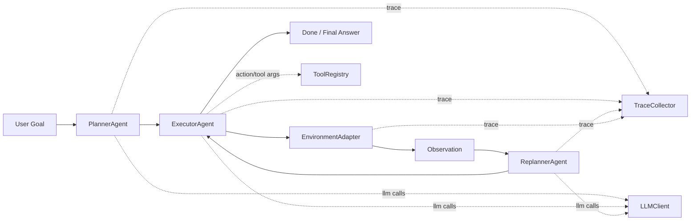

# Plan-and-Act Reproduction Framework (arXiv:2503.09572v3)

This project reproduces the core ideas of **Plan-and-Act: Improving Planning of Agents for Long-Horizon Tasks** and packages them as a clean, modular, research-friendly framework.

Paper:
- arXiv abstract: [2503.09572v3](https://arxiv.org/abs/2503.09572v3)
- PDF (downloaded): [`paper_assets/2503.09572v3.pdf`](paper_assets/2503.09572v3.pdf)
- HTML (downloaded): [`paper_assets/2503.09572v3.html`](paper_assets/2503.09572v3.html)

Documentation hub:
- Docs home: [`docs/README.md`](docs/README.md)
- Reading order: [`docs/READING_GUIDE.md`](docs/READING_GUIDE.md)
- Paper deep-dive review: [`docs/analysis/PLAN_AND_ACT_REVIEW.md`](docs/analysis/PLAN_AND_ACT_REVIEW.md)
- Architecture overview: [`docs/architecture/AGENT_FRAMEWORK_ARCHITECTURE.md`](docs/architecture/AGENT_FRAMEWORK_ARCHITECTURE.md)
- Visual architecture guide: [`docs/architecture/AGENT_ARCHITECTURE_VISUAL_GUIDE.md`](docs/architecture/AGENT_ARCHITECTURE_VISUAL_GUIDE.md)
- Reproduction plan: [`docs/plans/REPRODUCTION_PLAN.md`](docs/plans/REPRODUCTION_PLAN.md)
- Tracing-to-training plan: [`docs/plans/TRAINING_DATA_TRACING_PLAN.md`](docs/plans/TRAINING_DATA_TRACING_PLAN.md)

## 1) Paper Snapshot

Main idea from the paper:
1. Split roles into `Planner` (strategic decomposition) and `Executor` (grounded actions).
2. Improve planner quality with synthetic, grounded planning data.
3. Use dynamic replanning and CoT to improve long-horizon execution.

Key numbers reported in the paper review doc:
1. WebArena-Lite: up to `57.58%`.
2. WebVoyager (text-only): up to `81.36%`.
3. Synthetic data scale: `923` extra trajectories, `10,000` plan expansions, `5,000` targeted augmentations.

Reference: [`docs/analysis/PLAN_AND_ACT_REVIEW.md`](docs/analysis/PLAN_AND_ACT_REVIEW.md)

## 2) What Is Implemented Here

Implemented now:
1. Plan-and-Act runtime graph: `Planner -> Executor -> Replanner`.
2. Multi-step plan schema and structured action schema (Pydantic-validated).
3. Dynamic replanning control in code-level orchestration (LangGraph).
4. Domain adapters:
- `simulator` environment for deterministic smoke runs.
- `tool` environment for real tool calling.
5. Real tools without model API key:
- `web_search` (DuckDuckGo HTML endpoint)
- `fetch_url` (HTTP fetch + text extraction)
- `calculator` (safe AST evaluator)
- `github_top_contributor` (GitHub REST API)
6. Tracing infrastructure:
- session metadata + step events + LLM I/O traces
- artifacts at `data/raw/traces/<run_id>/`
7. Test suite for schemas, transitions, tools, tracing, eval utilities.
8. Notebook demos for module inspection and full trace monitoring.

Partially implemented / placeholder (for full paper-scale reproduction):
1. Full synthetic data engine at paper scale (`10k+` expanded plans) is scaffolded but still lightweight.
2. Browser-specific benchmark adapters (full WebArena/WebVoyager integration) are not yet fully wired here.
3. Trace-to-SFT conversion exists in base form and can be extended for stronger quality gates and lineage.

## 3) Architecture at a Glance



Core code entry points:
1. Workflow graph: [`src/plan_and_act/graph/workflow.py`](src/plan_and_act/graph/workflow.py)
2. Transition logic: [`src/plan_and_act/graph/transitions.py`](src/plan_and_act/graph/transitions.py)
3. CLI runner: [`src/plan_and_act/eval/runner.py`](src/plan_and_act/eval/runner.py)
4. Agents: [`src/plan_and_act/agents/`](src/plan_and_act/agents/)
5. Environments: [`src/plan_and_act/environments/`](src/plan_and_act/environments/)
6. Tools: [`src/plan_and_act/tools/`](src/plan_and_act/tools/)
7. Tracing: [`src/plan_and_act/tracing/`](src/plan_and_act/tracing/)

## 4) Structured I/O Contracts (Planner and Executor)

Planner output format:
```json
{
  "goal": "Find the top contributor of openai/openai-python",
  "steps": [
    {
      "step_id": 1,
      "intent": "Identify repository owner/repo and fetch contributor ranking",
      "success_criteria": "Top contributor is found"
    },
    {
      "step_id": 2,
      "intent": "Return concise final answer to user",
      "success_criteria": "Answer contains contributor login"
    }
  ]
}
```

Executor action format:
```json
{
  "action_type": "search",
  "target": "tool:github_top_contributor",
  "arguments": {
    "owner": "openai",
    "repo": "openai-python"
  },
  "rationale": "Use GitHub contributors endpoint",
  "is_final": false,
  "final_answer": ""
}
```

Schemas:
- [`src/plan_and_act/core/schemas.py`](src/plan_and_act/core/schemas.py)
- [`src/plan_and_act/core/state.py`](src/plan_and_act/core/state.py)

## 5) Project Layout

```text
plan_and_act_repro/
  README.md
  pyproject.toml
  configs/
    base.yaml
    models.yaml
    tracing.yaml
    prompts/
  docs/
    README.md
    READING_GUIDE.md
    analysis/
    architecture/
    plans/
    tracing/
  notebooks/
    01_plan_and_act_real_tool_demo.ipynb
    02_complex_query_full_trace_gpt4.ipynb
  paper_assets/
    2503.09572v3.pdf
    2503.09572v3.html
  scripts/
  src/plan_and_act/
  tests/
  data/
  artifacts/
```

## 6) Environment Setup

### Option A: Use your existing conda env (recommended if you already use `vllm`)

```bash
conda activate vllm
cd /Users/admin/TuanDung/paper_implementation/plan_and_act_repro
python -m pip install --upgrade pip
python -m pip install -e .[dev]
python -m pip install nbformat nbclient jupyter ipykernel
```

### Option B: Fresh local virtualenv

```bash
cd /Users/admin/TuanDung/paper_implementation/plan_and_act_repro
python3 -m venv .venv
source .venv/bin/activate
pip install --upgrade pip
pip install -e .[dev]
pip install nbformat nbclient jupyter ipykernel
```

Configure environment variables:

```bash
cp .env.example .env
# set OPENAI_API_KEY in .env
# optional: OPENAI_BASE_URL
```

## 7) Quick Run Commands

### 7.1 Real tools demo (no model API key required)

```bash
plan-act-run demo-tools \
  --query "plan and act llm agents" \
  --url "https://arxiv.org/abs/2503.09572v3" \
  --expression "(42 * 13) / 7 + sqrt(81)"
```

### 7.2 End-to-end episode with GPT-4 in simulator

```bash
plan-act-run run-episode \
  --goal "Find the top contributor of openai/openai-python" \
  --environment simulator \
  --dynamic-replanning \
  --trace
```

### 7.3 End-to-end episode with GPT-4 in tool environment

```bash
plan-act-run run-episode \
  --goal "Find the top contributor of openai/openai-python" \
  --environment tool \
  --dynamic-replanning \
  --use-cot \
  --trace
```

### 7.4 Run traced script helper

```bash
./scripts/run_episode_with_trace.sh
```

### 7.5 Execute notebook as an integration check

```bash
./scripts/test_notebook.sh
```

## 8) Tracing and Training-Data Workflow

Trace outputs:
1. Session metadata: `data/raw/traces/<run_id>/session.json`
2. Event timeline: `data/raw/traces/<run_id>/events.jsonl`

Typical event types:
1. `planner_input`, `planner_output`
2. `executor_input`, `executor_output`
3. `environment_step`
4. `replanner_input`, `replanner_output`
5. `llm_call`
6. `tool_call_start`, `tool_call_end`
7. `episode_end`, `episode_error`

From traces to SFT records:
- Base SFT builder: [`src/plan_and_act/training/build_sft_data.py`](src/plan_and_act/training/build_sft_data.py)
- Plan and checklist docs:
- [`docs/plans/TRAINING_DATA_TRACING_PLAN.md`](docs/plans/TRAINING_DATA_TRACING_PLAN.md)
- [`docs/tracing/TRACE_DATA_REVIEW_MINDSET.md`](docs/tracing/TRACE_DATA_REVIEW_MINDSET.md)
- [`docs/tracing/TRACE_DATA_REVIEW_CHECKLIST.md`](docs/tracing/TRACE_DATA_REVIEW_CHECKLIST.md)
- [`docs/tracing/TRACE_TO_SFT_CODE_REVIEW_WALKTHROUGH.md`](docs/tracing/TRACE_TO_SFT_CODE_REVIEW_WALKTHROUGH.md)

## 9) Notebooks

1. Real tools + module inspection:
- [`notebooks/01_plan_and_act_real_tool_demo.ipynb`](notebooks/01_plan_and_act_real_tool_demo.ipynb)

2. Complex query + full planner/executor LLM I/O monitoring:
- [`notebooks/02_complex_query_full_trace_gpt4.ipynb`](notebooks/02_complex_query_full_trace_gpt4.ipynb)

## 10) Testing

Run all tests:

```bash
pytest -q
```

Useful focused runs:

```bash
pytest -q tests/test_planner_output_schema.py
pytest -q tests/test_replanning_transition.py
pytest -q tests/test_tracing_infra.py
pytest -q tests/test_tools_builtin.py
```

## 11) Known Limitations

1. Planner is structured-output and multi-step, but explicit tool-manifest conditioning can be expanded further.
2. Synthetic data modules under `src/plan_and_act/data/` are still scaffold-level, not full paper-scale generation.
3. Full benchmark parity with WebArena/WebVoyager paper numbers requires additional benchmark-specific infra and model stacks.

## 12) Troubleshooting

### `ImportError: cannot import name 'RootModel' from 'pydantic'`

Cause: incompatible `pydantic` version in your active environment.

Fix:

```bash
python -m pip install --upgrade "pydantic>=2.8,<3"
python -m pip install -e .[dev]
```

### Notebook execution fails due missing kernel dependencies

```bash
python -m pip install nbformat nbclient jupyter ipykernel
```

### `OPENAI_API_KEY` not detected

1. Ensure `.env` exists in project root.
2. Ensure key is not empty.
3. Restart shell session if environment caching occurred.

## 13) Security and Secret Hygiene

1. Never commit `.env`.
2. Rotate exposed keys immediately.
3. Tracing redacts OpenAI key-like patterns from logged prompt/response fields.

## 14) Suggested Reading Path

1. Start here: [`docs/READING_GUIDE.md`](docs/READING_GUIDE.md)
2. Understand paper contributions: [`docs/analysis/PLAN_AND_ACT_REVIEW.md`](docs/analysis/PLAN_AND_ACT_REVIEW.md)
3. Understand architecture and orchestration:
- [`docs/architecture/AGENT_FRAMEWORK_ARCHITECTURE.md`](docs/architecture/AGENT_FRAMEWORK_ARCHITECTURE.md)
- [`docs/architecture/AGENT_ARCHITECTURE_VISUAL_GUIDE.md`](docs/architecture/AGENT_ARCHITECTURE_VISUAL_GUIDE.md)
- [`docs/architecture/ORCHESTRATION_SUBAGENTS_PSEUDOCODE.md`](docs/architecture/ORCHESTRATION_SUBAGENTS_PSEUDOCODE.md)
4. Move to reproduction/tracing plans:
- [`docs/plans/REPRODUCTION_PLAN.md`](docs/plans/REPRODUCTION_PLAN.md)
- [`docs/plans/TRAINING_DATA_TRACING_PLAN.md`](docs/plans/TRAINING_DATA_TRACING_PLAN.md)
